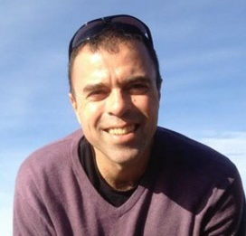
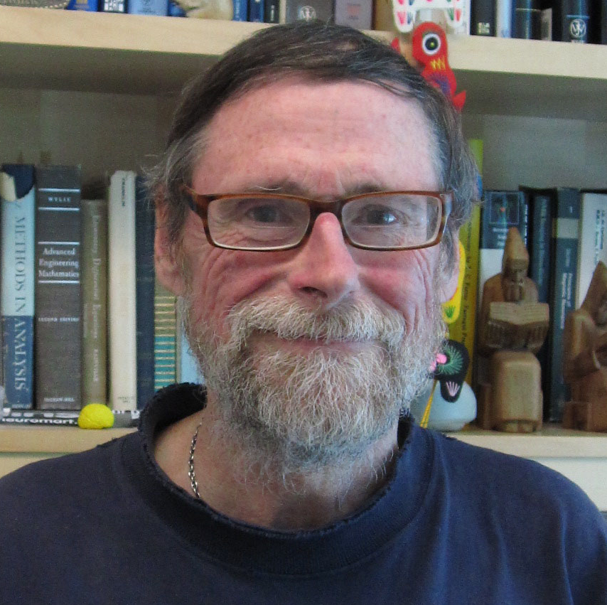
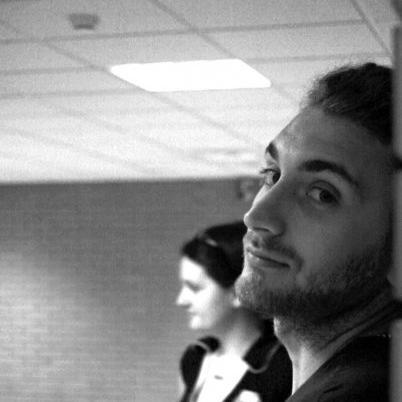

# Summary

There is a rapidly growing momentum in the field directed towards quantifying the fluctuations in intrinsic (at rest) brain activity or connectivity over time. Although several innovative methods are already proposed, they usually invariably average (or smooth) the data in space (by using seed- or network-based approaches) or time (e.g., by using a sliding-window), thereby perhaps not examining these fluctuations in their entirety. Funded by an NIMH K99/R00 Career Development Award and a NARSAD Young Investigator Award, we are developing new computational methods that could allow for an understanding of brain's dynamical landscape without arbitrarily averaging the spatiotemporal data.

# Presentations/Papers

1. Saggar, M., Sporns, O., Gonzalez-Castillo, J., Bandettini, P.A., Carlsson, G., Glover, G., Reiss, A.L. (2018) Towards a new approach to reveal dynamical organization of the brain using topological data analysis. Nature Communications. doi:[10.1038/s41467-018-03664-4](https://www.nature.com/articles/s41467-018-03664-4)

2. Saggar, M., Sporns, O., Carlsson, G., Glover, G., Reiss, A.L.(2017) Revealing the Shape of Brain Dynamics during “Ongoing” Cognition. Oral presentation at the Keystone Symposium on Connectomics (X2), Santa Fe, New Mexico .

3. Saggar, M., Sporns, O., Carlsson, G., Glover, G., Reiss, AL. (2016) Revealing the shape of brain dynamics during ongoing cognition. Oral Presentation at the Neural Information Processing Systems (NIPS) workshop on Connectomics, Barcelona, Spain .

4. Saggar, M., Glover, G., Carlsson, G., Reiss, AL. (2016) Quantifying fluctuations in intrinsic brain activity without spatial or temporal averaging using topology. Oral Presentation at the 3rd Biennial Whistler Scientific Workshop on Brain Functional Organization, Connectivity and Behavior, Whistler, Canada.

# Collaborators

    
    <a href="http://psych.indiana.edu/faculty/osporns.php" target="_blank">Olaf Sporns</a>

    
    <a href="https://profiles.stanford.edu/gunnar-carlsson" target="_blank">Gunnar Carlsson</a>

    
    <a href="https://profiles.stanford.edu/allan-reiss" target="_blank">Allan Reiss</a>

    
    <a href="https://fim.nimh.nih.gov/profiles/peter-bandettini-phd" target="_blank">Peter Bandettini</a>

    
    <a href="https://fim.nimh.nih.gov/profiles/javier-gonzalez-castillo" target="_blank">Javier Gonzalez-Castillo</a>

    
    <a href="https://profiles.stanford.edu/gary-glover" target="_blank">Gary Glover</a>

    
    <a href="https://www.bu.edu/eng/profile/david-boas-ph-d" target="_blank">David Boas</a>

    
    <a href="https://www.isi.it/en/people/giovanni-petri" target="_blank">Giovanni Petri</a>

# Funding

    

    

    

